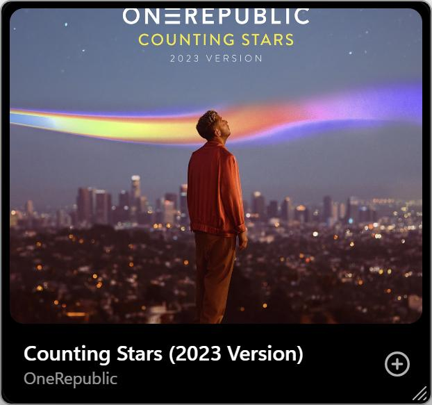

<h1 align="center">ByTune</h1>

<p align="center">
  <strong>An open-source desktop music player for Windows.</strong><br>
  Stream from YouTube Music, keep your own library, and get synced lyrics,
  a fullscreen player, a mini player and real downloads — in one fast, native-feeling app.
</p>

<p align="center">
  <a href="#installation">Download</a> ·
  <a href="https://bytune.vercel.app/">Website</a> ·
  <a href="https://github.com/rishiteja21/ByTune/releases">Releases</a> ·
  <a href="#contributing">Contributing</a> ·
  <a href="#license">License</a>
</p>

<p align="center">
  <a href="https://github.com/rishiteja21/ByTune/releases/latest"></a>
  <a href="LICENSE"></a>
  
  <a href="https://bytune.vercel.app/"></a>
</p>

<p align="center">
  
</p>

---

## What is ByTune?

ByTune is a free, open-source music player for Windows, built with Electron, React and TypeScript. It plays streaming music from YouTube Music (no login required) alongside your own local files, and wraps both in a proper desktop player: a queue, synced lyrics, playlists, downloads, listening stats and keyboard shortcuts.

It started as a desktop port of the GPL-licensed BitChord Android player, then grew into a Windows-native app of its own.

**Highlights**

- **YouTube Music on the desktop** — home feed, search across songs / videos / albums / artists / playlists, album and artist pages, all without an account
- **Word-synced lyrics** — the current line (and word) highlighted in time with the music, auto-scrolling, click any line to jump; YouTube Music plus an [LRCLIB](https://lrclib.net) fallback
- **Fullscreen Now Playing** — big artwork, queue and lyrics in one view; optional YouTube "canvas" video clips
- **Mini player (picture-in-picture)** — a compact always-on-top window that stays out of the way
- **Local music library** — import folders, get albums/artists/sorting, with non-music audio (voice notes, clips) filtered out
- **Downloads** — save any track as an audio file with live progress and a configurable folder
- **Replay** — your listening counted over time: top artists, top songs, hours, monthly and hourly patterns
- **Windows integration** — media keys and the SMTC media overlay, custom title bar, right-click context menus

## Screenshots

### Fullscreen when you want the music to take over

<p align="center">
  
</p>

Click the artwork in the player bar (or press <kbd>N</kbd>) for a cinematic view: large artwork, a live visualizer, the queue and word-synced lyrics — all tinted by the colors of the current track.

### Lyrics that stay with the song

<p align="center">
  
</p>

Lyrics open in the main view or the fullscreen player, highlight the current word, auto-scroll, and let you click any line to seek there. If YouTube Music has no lyrics for a track, ByTune falls back to LRCLIB — so almost every song has them.

### Keep the controls close

<p align="center">
  
</p>

The mini player is a real picture-in-picture window: always on top, resizable, with playback controls on hover. Work in something else and keep the music one glance away.

### Find what you want

<p align="center">
  
</p>

Search songs, videos, albums, artists and playlists from YouTube Music, with live suggestions as you type. Press <kbd>/</kbd> to jump to the search bar from anywhere.

### Queue and library

<p align="center">
  
</p>

A proper queue: see what's playing and what's next, reorder by drag, add with "Play next" or "Add to queue" from any track's right-click menu, and keep the music going with Autoplay when the queue ends. Shuffle, repeat (off / all / one) and crossfade are one click away.

<p align="center">
  
</p>

Your library persists on disk and restores on launch: liked songs, your own playlists, downloads and listening history — with an optional account to keep it safe in the cloud.

### Your own files

<p align="center">
  
</p>

Import folders from your PC and they sit beside your streaming library — full track lists, album and artist browsing, embedded artwork, and a filter that hides short recordings and voice notes.

### Downloads

<p align="center">
  
</p>

Save any track as a `.m4a` file (lossless-quality option available), with live progress, an "Open folder" shortcut and a configurable download location.

### Make it yours

<p align="center">
  
</p>

Streaming quality ceilings, lossless downloads, crossfade and beat-aware Auto Mix, skip silence, autoplay, pitch-preserving playback speed, lyric behavior, appearance (liquid glass, reduced motion) and local-music management — all in one settings page.

## Feature overview

| Feature | ByTune |
|---|---|
| Streaming from YouTube Music (no login required) | ✅ |
| Search (songs / videos / albums / artists / playlists) | ✅ |
| Word-synced lyrics with click-to-seek | ✅ |
| Fullscreen Now Playing view | ✅ |
| Mini player (picture-in-picture) | ✅ |
| Queue with reorder, play next, autoplay | ✅ |
| Playlists, liked songs, listening history | ✅ |
| Local music library (folder import) | ✅ |
| Downloads (.m4a, configurable folder) | ✅ |
| Listening statistics (Replay) | ✅ |
| Crossfade, Auto Mix, skip silence, playback speed | ✅ |
| Optional account with library backup | ✅ |
| Windows media keys + SMTC overlay | ✅ |
| Keyboard shortcuts | ✅ |
| Artwork-driven ambient theming (dark) | ✅ |
| Light theme | ❌ (dark only, by design) |

## Why ByTune?

- **Desktop-first.** A real window, media keys, keyboard shortcuts, a taskbar-friendly mini player — not a website in a wrapper.
- **Open source.** GPL-3.0; every line is inspectable and contributions are welcome.
- **Two libraries, one player.** Streaming from YouTube Music and your own files, side by side, with the same queue, lyrics and downloads.
- **No login required.** Guest mode keeps your data on this PC; accounts are optional.
- **Honest software.** No ads, no telemetry walls, no features that exist only in marketing.

ByTune is not affiliated with or endorsed by YouTube/Google.

## Built with

**Application** — Electron · React 18 · TypeScript · Tailwind CSS · Zustand

**Streaming & audio** — youtubei.js (YouTube Music / InnerTube) · bgutils-js (BotGuard PO tokens) · music-metadata (local files)

**Backend (optional account)** — Supabase (auth + library backup)

**Build & tooling** — Vite · esbuild · electron-builder (NSIS installer) · Node's built-in test runner

## Installation

### Download the app

- **Windows 10/11 (64-bit)** — grab the installer from the latest release:
  **[Download ByTune-Setup.exe](https://github.com/rishiteja21/ByTune/releases/latest/download/ByTune-Setup.exe)** ← always points at the newest build
- **macOS** — coming soon
- Also available on the [website](https://bytune.vercel.app/) and the [releases page](https://github.com/rishiteja21/ByTune/releases)

Run the installer, launch ByTune, and pick **Continue as guest** (data stays on this PC) or create an account for cloud backup.

### From source

```bash
git clone https://github.com/rishiteja21/ByTune.git
cd ByTune
npm install
npm run dev        # vite + electron with hot reload
```

### Useful commands

```bash
npm test           # unit tests (node --test)
npm run typecheck  # tsc --noEmit
npm run dist       # typecheck + build + NSIS installer into release/
```

## Architecture

```
Renderer (React + Tailwind + Zustand)
  views/            home, search, album, artist, playlist, library,
                    local music, downloads, replay, settings
  components/       design-system primitives, sidebar, player bar,
                    queue, lyrics, context menus, toasts
  lib/              audio engine, artwork ambience, lyrics, downloads,
                    persistence
        │  IPC (contextBridge preload)
Main process (Electron)
  music-service.ts  YouTube Music: search/albums/playlists/home/lyrics
                    + stream resolution (rotating InnerTube clients)
  po-token.ts       BotGuard PO-token minting (sandboxed JSDOM + bgutils-js)
  stream-proxy.ts   local 127.0.0.1 range-aware streaming proxy
  downloads.ts      track downloader with progress events
  persist.ts        JSON persistence for library/settings stores
```

Streaming uses no login: a BotGuard challenge is solved locally (same approach as the [bgutil](https://github.com/Brainicism/bgutil-ytdlp-pot-provider) provider), the resulting PO token is bound to the session, and googlevideo traffic flows through a small local proxy so the media element plays from localhost. If every InnerTube route fails, public Piped mirrors are tried as a last resort. YouTube changes this plumbing often — if playback ever breaks, `npm i youtubei.js@latest` usually fixes it.

## Contributing

Contributions are welcome! See [CONTRIBUTING.md](CONTRIBUTING.md) for setup, tests and pull-request guidelines. Bug reports and feature ideas go to the [issue tracker](https://github.com/rishiteja21/ByTune/issues).

## License

ByTune is licensed under the **GNU GPL v3** (see [LICENSE](LICENSE)). It began as a fork of the BitChord Android player, which shares this license — thank you to its author for building in the open.

Please use ByTune responsibly and in accordance with the terms of the services it accesses.

## Links

- Website: <https://bytune.vercel.app/>
- Releases: <https://github.com/rishiteja21/ByTune/releases>
- Latest Windows installer: <https://github.com/rishiteja21/ByTune/releases/latest/download/ByTune-Setup.exe>
- Issue tracker: <https://github.com/rishiteja21/ByTune/issues>
