# ByTune — YouTube Music desktop app for Windows

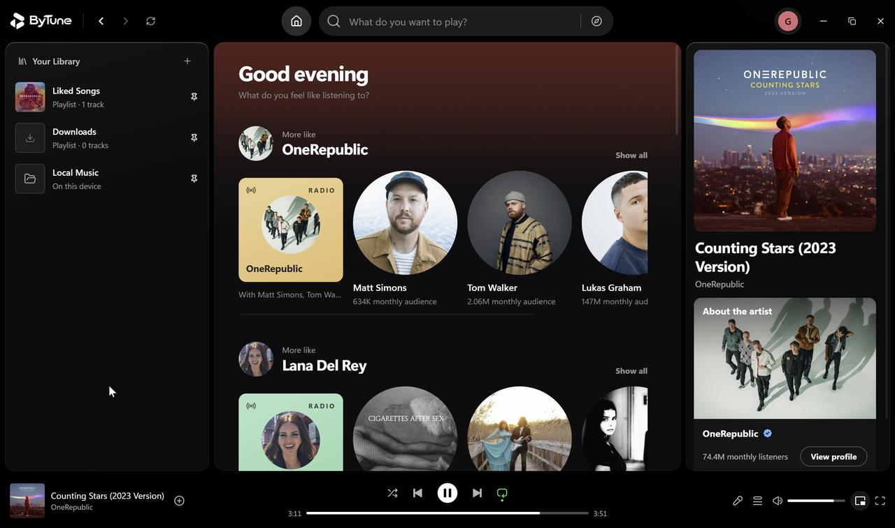

**ByTune is a free, open-source YouTube Music desktop app for Windows.** Stream music, keep your own library, and get word-synced lyrics, a fullscreen player, a mini player and real downloads — in one fast, native-feeling app.

**[Download](#installation)** · **[Website](https://bytune.space/)** · **[Releases](https://github.com/rishiteja21/ByTune/releases)** · **[Contributing](CONTRIBUTING.md)** · **[License](#license)**

[](https://github.com/rishiteja21/ByTune/releases/latest)
[](LICENSE)
[](#installation)

---

## What is ByTune?

ByTune is a free, open-source music player for Windows, built with Electron, React and TypeScript. It plays streaming music from YouTube Music (no login required) alongside your own local files, and wraps both in a proper desktop player: a queue, synced lyrics, playlists, downloads, listening stats and keyboard shortcuts.

It started as a desktop port of the GPL-licensed BitChord Android player, then grew into a Windows-native app of its own.

**Highlights**

- **YouTube Music on the desktop** — home feed, search across songs / videos / albums / artists / playlists, album and artist pages, all without an account
- **Word-synced lyrics** — the current line (and word) highlighted in time with the music, auto-scrolling, click any line to jump; YouTube Music lyrics with an [LRCLIB](https://lrclib.net) fallback when they're missing
- **Fullscreen Now Playing** — big artwork, queue and lyrics in one view; optional YouTube canvas video clips
- **Mini player (picture-in-picture)** — a compact always-on-top window that stays out of the way
- **Local music library** — import folders, get albums/artists/sorting, with non-music audio (voice notes, clips) filtered out
- **Downloads** — save any track as a `.m4a` file, with live progress and configurable folder and quality
- **Replay** — your listening counted over time: top artists, top songs, hours, monthly and hourly patterns
- **Windows integration** — media keys and the SMTC media overlay, custom title bar, right-click context menus

## Screenshots

### The player

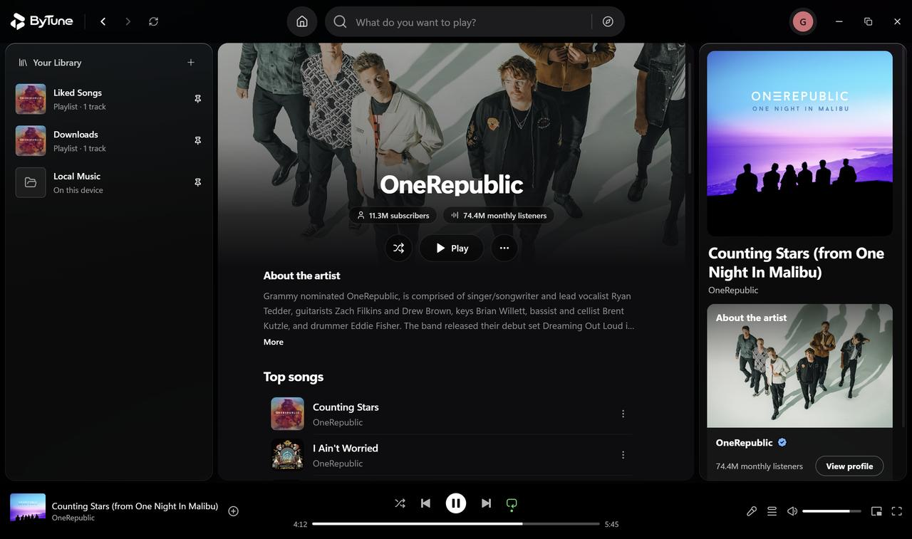

Album pages, artist pages and the persistent player bar: every view keeps playback, the queue and lyrics one click away.

### Fullscreen

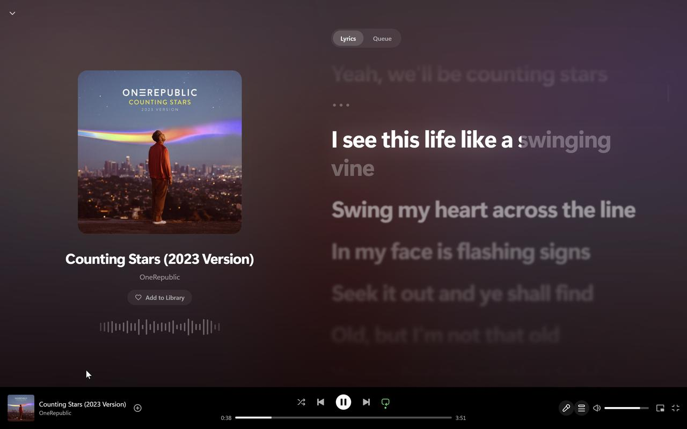

Click the artwork in the player bar (or press <kbd>N</kbd>) for a cinematic view: large artwork, a live visualizer, the queue and word-synced lyrics — all tinted by the colors of the current track.

### Mini player

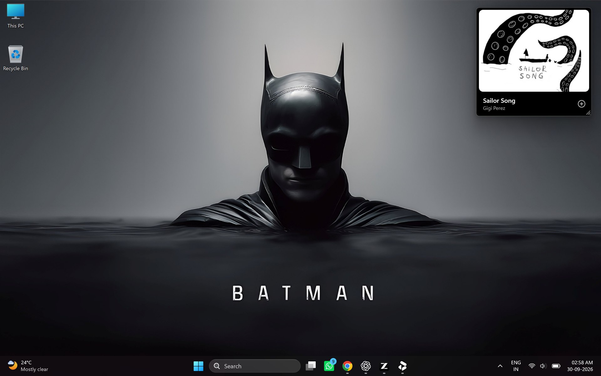

The mini player is a real picture-in-picture window: always on top, resizable, with playback controls on hover. Work in something else and keep the music one glance away.

### Lyrics

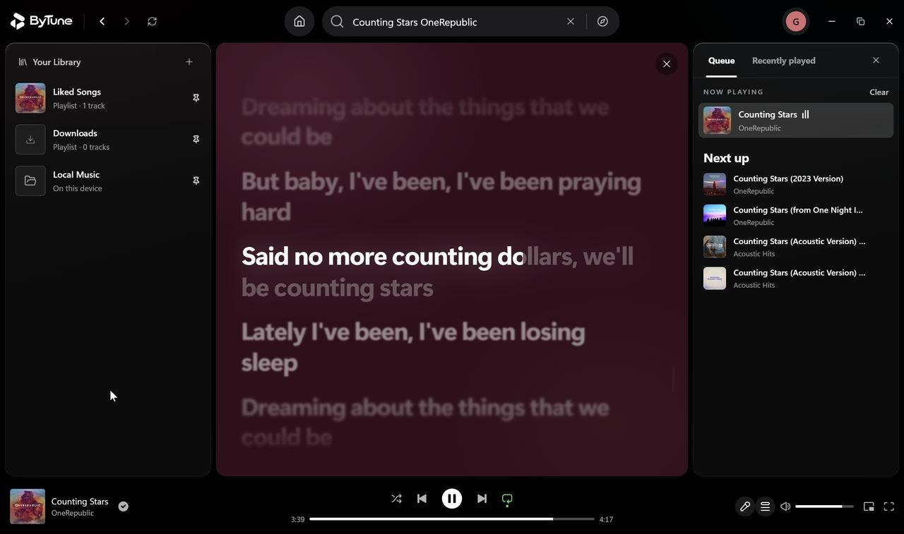

Lyrics open in the main view or the fullscreen player, highlight the current word, auto-scroll, and let you click any line to seek there. If YouTube Music has no lyrics for a track, ByTune falls back to LRCLIB.

### Search

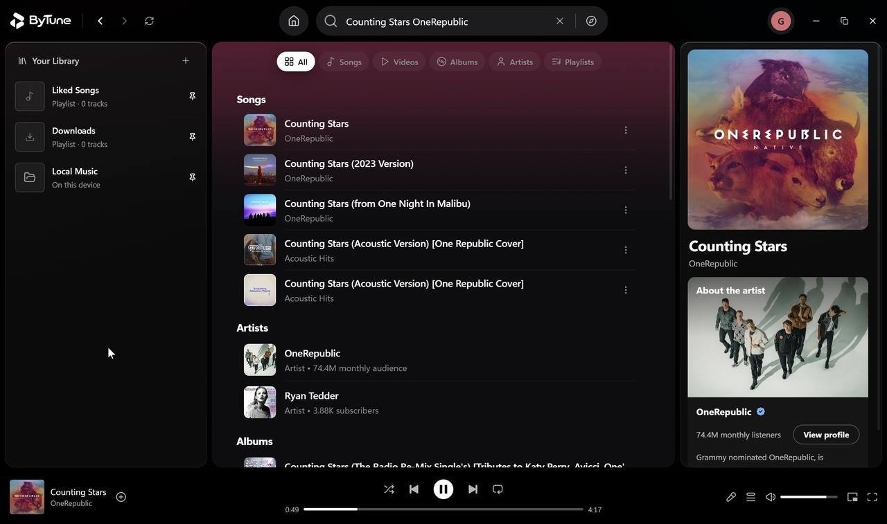

Search songs, videos, albums, artists and playlists from YouTube Music, with live suggestions as you type. Press <kbd>/</kbd> to jump to the search bar from anywhere.

### Queue & playlists

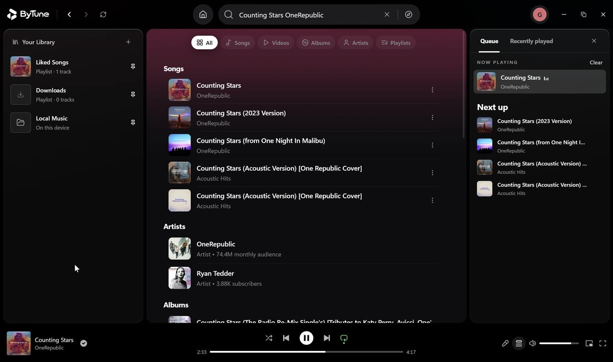

A proper queue: see what's playing and what's next, reorder by drag, add with "Play next" or "Add to queue" from any track's right-click menu, and keep the music going with Autoplay when the queue ends. Shuffle, repeat (off / all / one) and crossfade are one click away.

### Your library

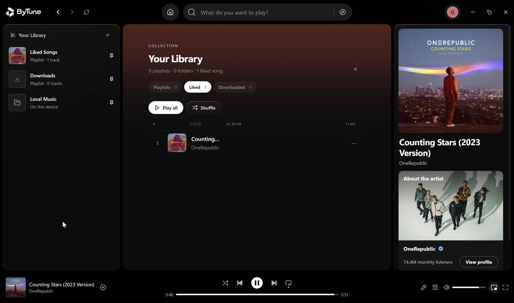

Your library persists on disk and restores on launch: liked songs, your own playlists, downloads and listening history — with an optional account to keep it safe even if this PC's app data is wiped.

### Local music

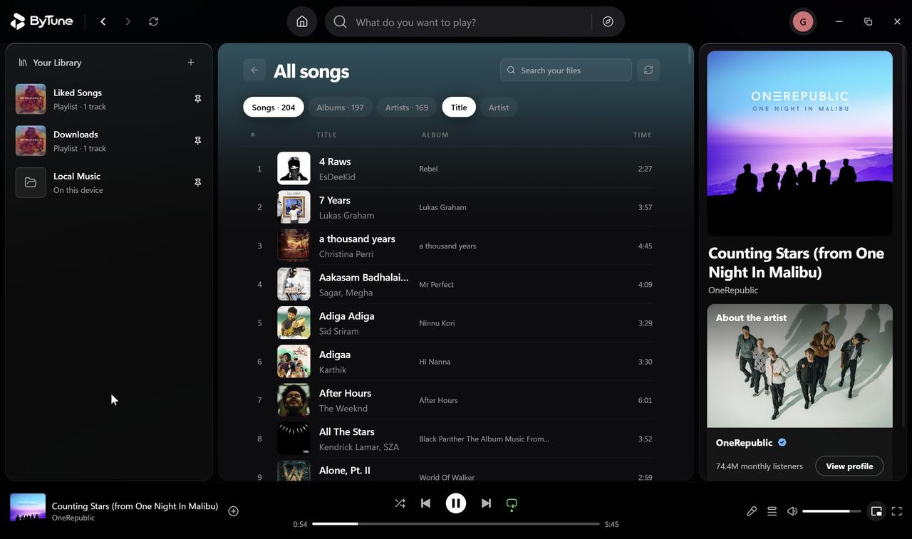

Import folders from your PC and they sit beside your streaming library — full track lists, album and artist browsing, embedded artwork, and a filter that hides short recordings and voice notes.

### Downloads

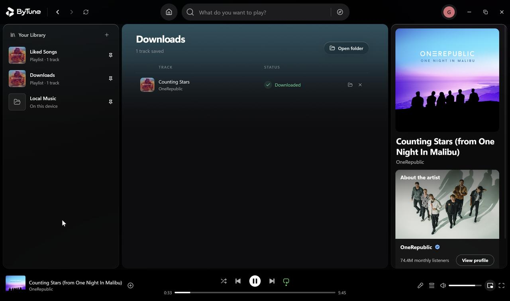

Save any track as a `.m4a` file, with live progress, an "Open folder" shortcut, a configurable download location and quality options up to the app's "Lossless" setting.

### Settings

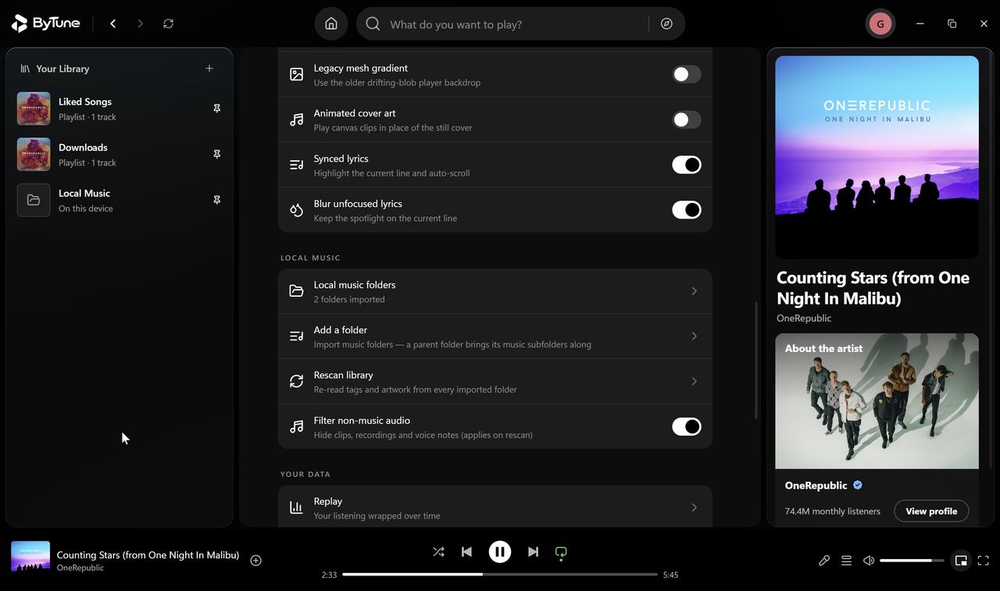

Streaming quality ceilings, download quality, crossfade and Auto Mix, skip silence, autoplay, pitch-preserving playback speed, lyric behavior, appearance (liquid glass, reduced motion) and local-music management — all in one settings page.

## Feature overview

| Feature | ByTune |
|---|---|
| Streaming from YouTube Music (no login required) | ✅ |
| Search (songs / videos / albums / artists / playlists) | ✅ |
| Word-synced lyrics with click-to-seek | ✅ |
| Fullscreen Now Playing view | ✅ |
| Mini player (picture-in-picture) | ✅ |
| Queue with reorder, play next, autoplay | ✅ |
| Playlists, liked songs, listening history | ✅ |
| Local music library (folder import) | ✅ |
| Downloads (.m4a, configurable folder & quality) | ✅ |
| Listening statistics (Replay) | ✅ |
| Crossfade, Auto Mix, skip silence, playback speed | ✅ |
| Optional account with library backup | ✅ |
| Windows media keys + SMTC overlay | ✅ |
| Keyboard shortcuts | ✅ |
| Artwork-driven ambient theming (dark) | ✅ |
| Light theme | ❌ (dark only, by design) |

## Why ByTune?

- **Desktop-first.** A real window, media keys, keyboard shortcuts, a taskbar-friendly mini player — not a website in a wrapper.
- **Open source.** GPL-3.0; every line is inspectable and contributions are welcome.
- **Two libraries, one player.** Streaming from YouTube Music and your own files, side by side, with the same queue, lyrics and downloads.
- **No login required.** Guest mode keeps your data on this PC; accounts are optional.
- **Free, in the open.** No subscriptions, no locked features, no dark patterns.

## FAQ

**Is ByTune free?**

Yes. It's open source under GPL-3.0, with no subscriptions, no ads and no locked features.

**Does it need a YouTube Music Premium or Google account?**

No. ByTune streams from YouTube Music without logging in — an account is only used if you turn on the optional cloud backup for your library.

**Is this the official YouTube Music app?**

No. ByTune is an independent, open-source desktop player that uses YouTube Music as a streaming source. It is not affiliated with or endorsed by YouTube or Google.

**Which platforms does it run on?**

Windows 10 and 11 (64-bit). macOS support is in the works.

**Can I save songs for offline listening?**

Yes — any track can be downloaded as a `.m4a` file, with your choice of folder and quality.

## Built with

**Application** — Electron · React 18 · TypeScript · Tailwind CSS · Zustand

**Streaming & audio** — youtubei.js (YouTube Music / InnerTube) · bgutils-js (BotGuard PO tokens) · music-metadata (local files)

**Backend (optional account)** — Supabase (auth + library backup)

**Build & tooling** — Vite · esbuild · electron-builder (NSIS installer) · Node's built-in test runner

## Installation

### Download the app

- **Windows 10/11 (64-bit)** — grab the installer from the latest release:
  **[Download ByTune-Setup.exe](https://github.com/rishiteja21/ByTune/releases/latest/download/ByTune-Setup.exe)** ← always points at the newest build
- **macOS** — coming soon
- Also available on the [website](https://bytune.space/) and the [releases page](https://github.com/rishiteja21/ByTune/releases)

Run the installer, launch ByTune, and pick **Continue as guest** (data stays on this PC) or create an account for cloud backup.

### Development

```bash
git clone https://github.com/rishiteja21/ByTune.git
cd ByTune
npm install
npm run dev        # vite + electron with hot reload
```

Useful commands:

```bash
npm test           # unit tests (node --test)
npm run typecheck  # tsc --noEmit
npm run dist       # typecheck + build + NSIS installer into release/
```

See [CONTRIBUTING.md](CONTRIBUTING.md) for setup details, tests and pull-request guidelines. Bug reports and feature ideas go to the [issue tracker](https://github.com/rishiteja21/ByTune/issues).

## Architecture

```
UI (React views + components)
        │
Application state (Zustand stores: player · library · settings · ui)
        │
Audio engine & player bar (playback, MediaSession, shortcuts)
        │  IPC (contextBridge preload)
Electron main process
  ├─ music-service   YouTube Music search / albums / playlists / lyrics / streams
  ├─ stream-proxy    local range-aware media proxy
  ├─ downloads       track downloader with progress events
  └─ persist         JSON persistence for your library & settings
        │
Providers & storage (YouTube Music · LRCLIB · local files · optional Supabase account)
```

A deeper dive — including how anonymous YouTube Music streaming works (BotGuard PO tokens, InnerTube client rotation, the local stream proxy) and how persistence, Auto Mix analysis and local-music scanning are implemented — lives in [docs/ARCHITECTURE.md](docs/ARCHITECTURE.md).

## License

ByTune is licensed under the **GNU GPL v3** (see [LICENSE](LICENSE)). It began as a fork of the BitChord Android player, which shares this license — thank you to its author for building in the open.

Please use ByTune responsibly and in accordance with the terms of the services it accesses.

## Links

- Website: <https://bytune.space/>
- Releases: <https://github.com/rishiteja21/ByTune/releases>
- Latest Windows installer: <https://github.com/rishiteja21/ByTune/releases/latest/download/ByTune-Setup.exe>
- Architecture deep dive: [docs/ARCHITECTURE.md](docs/ARCHITECTURE.md)
- Issue tracker: <https://github.com/rishiteja21/ByTune/issues>
